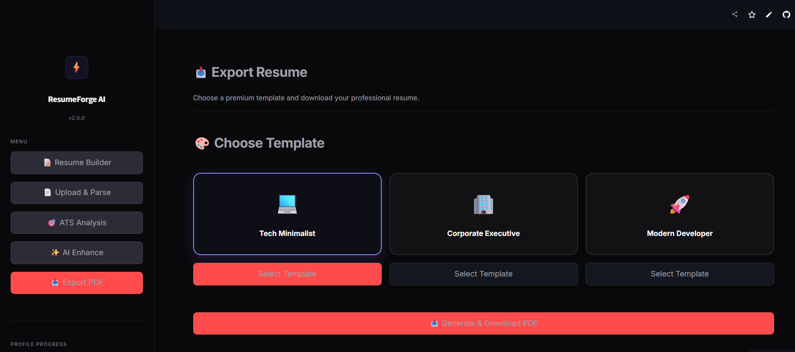
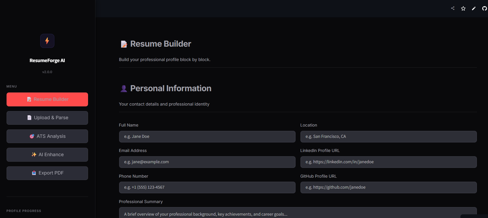

# ResumeForge AI ⚡

> **A production-grade, AI-powered resume builder engineered to help you land your dream job.**

ResumeForge AI is a premium SaaS application designed to eliminate the friction of resume creation. By leveraging the latest in Generative AI (GPT-4o-mini), it automatically extracts data from old PDFs, performs semantic ATS (Applicant Tracking System) gap analysis against job descriptions, intelligently rewrites bullet points using the Google XYZ impact formula, and generates beautiful, pixel-perfect PDF resumes.

Designed with a stunning **Vercel/Linear-inspired aesthetic**, it features a robust dark/light mode system, seamless glassmorphism UI, and an enterprise-grade modular backend architecture.

---

## 🌟 Core Features

- **🧠 Intelligent PDF Parsing:** Upload your existing, poorly-formatted resume, and let our AI instantly extract, structure, and populate the entire builder.
- **🎯 Semantic ATS Engine:** Paste a target Job Description. The ATS engine runs semantic analysis to score your resume, identify missing keywords, and suggest actionable improvements.
- **✨ AI Content Enhancement:** Automatically rewrite weak bullet points using the industry-standard XYZ formula (Accomplished [X] as measured by [Y], by doing [Z]).
- **🎨 Premium Dark/Light UI:** A flawless, meticulously designed interface with a custom segmented control theme toggle, smooth micro-animations, and glassmorphism cards.
- **📥 Multi-Template PDF Export:** Instantly generate professional PDFs using tailored templates (*Tech Minimalist, Corporate Executive, Modern Developer*).

---

## 📸 Screenshots

### Resume Builder



### Export PDF



---

## 🛠️ Tech Stack

| Layer | Technology |
|-------|-----------|
| **Frontend & UI** | Streamlit, Custom Advanced CSS (Vercel/Linear aesthetics) |
| **Artificial Intelligence** | OpenAI SDK (GPT-4o-mini) with Structured JSON outputs |
| **Data Validation** | Pydantic v2 |
| **PDF Generation** | FPDF2 |
| **Persistence** | SQLite with parameterized queries |
| **PDF Parsing** | PyPDF2 |

---

## 📂 Folder Structure

```text
app/
├── main.py                  # Application entry point and router
├── config.py                # Environment, constants & OpenAI client
├── models/
│   └── resume_schema.py     # Pydantic data models & validation
├── services/
│   ├── ai_service.py        # Centralized OpenAI API wrapper with retry logic
│   ├── parser_service.py    # PDF extraction and structural parsing pipeline
│   ├── ats_service.py       # ATS matching and gap analysis engine
│   ├── enhance_service.py   # AI bullet and summary rewriting
│   └── pdf_service.py       # Multi-template dynamic PDF generation engine
├── database/
│   └── db.py                # SQLite persistence layer
├── ui/
│   ├── dashboard.py         # Main tab orchestration & UI layout
│   ├── form_sections.py     # Builder input sections
│   ├── sidebar.py           # Navigation and progress tracker
│   ├── components.py        # Reusable UI elements (cards, rings, skeletons)
│   └── styles.py            # Premium SaaS Custom CSS injection
└── utils/
    ├── constants.py          # Application constants and session keys
    ├── helpers.py            # Utility and formatting functions
    └── validators.py         # Input validation logic
```

---

## 🚀 Installation Guide

### Prerequisites
- Python 3.10 or higher
- Git
- An OpenAI API Key

### Step-by-step Setup

1. **Clone the repository:**
   ```bash
   git clone <your-repo-url>
   cd Minor_project_6th
   ```

2. **Create and activate a virtual environment:**
   ```bash
   # Windows
   python -m venv venv
   venv\Scripts\activate

   # macOS/Linux
   python3 -m venv venv
   source venv/bin/activate
   ```

3. **Install dependencies:**
   ```bash
   pip install -r requirements.txt
   ```

---

## 🔑 Environment Variables Setup

You must set up your environment variables for the AI features to work.

1. Create a file named `.env` in the root directory.
2. Add your OpenAI API key:
   ```env
   OPENAI_API_KEY=your_actual_openai_api_key_here
   ```
*(Note: Do not commit `.env` to version control. The `.gitignore` file is already configured to prevent this).*

---

## 💻 Run Locally

To start the application, run the following command from the root directory:

```bash
streamlit run app/main.py
```

The application will launch in your default web browser at `http://localhost:8501`.

---

## 📖 Usage Guide

1. **Start Building:** Navigate to the **Resume Builder** tab to manually enter your details, or use **Upload & Parse** to extract data from an old PDF automatically.
2. **Track Progress:** Watch the Completion Tracker in the sidebar to ensure your profile is fully fleshed out.
3. **Enhance Content:** Go to the **AI Enhance** tab. Click on your experience bullets to magically rewrite them using impact-driven metrics (XYZ formula).
4. **Target a Job:** Open the **ATS Analysis** tab. Paste the Job Description you are applying for, and let the AI tell you exactly which keywords and skills you are missing.
5. **Export:** Head to **Export PDF**, select a beautifully crafted template, and download your final resume.

---

## 🔮 Future Improvements

- **User Authentication:** Integrate OAuth (Google/GitHub) for multi-user support.
- **Cover Letter Generation:** Add an AI module to generate highly targeted cover letters based on the ATS analysis.
- **Custom Fonts:** Expand the PDF engine to support custom uploaded `.ttf` fonts for maximum personalization.
- **Web Scraping:** Allow users to paste a LinkedIn URL instead of uploading a PDF to pull initial data.

---

## 🤝 Contributing

Contributions are always welcome! If you'd like to improve the project:
1. Fork the repository
2. Create a feature branch (`git checkout -b feature/AmazingFeature`)
3. Commit your changes (`git commit -m 'Add some AmazingFeature'`)
4. Push to the branch (`git push origin feature/AmazingFeature`)
5. Open a Pull Request

---

## 📄 License

Distributed under the MIT License. See `LICENSE` for more information.

---

## 👨‍💻 Author

Built with ❤️ by **Dhruv Mohan Shukla**
- GitHub: https://github.com/dhruvmohan867
- LinkedIn: https://www.linkedin.com/in/dhruvmohanshukla/
